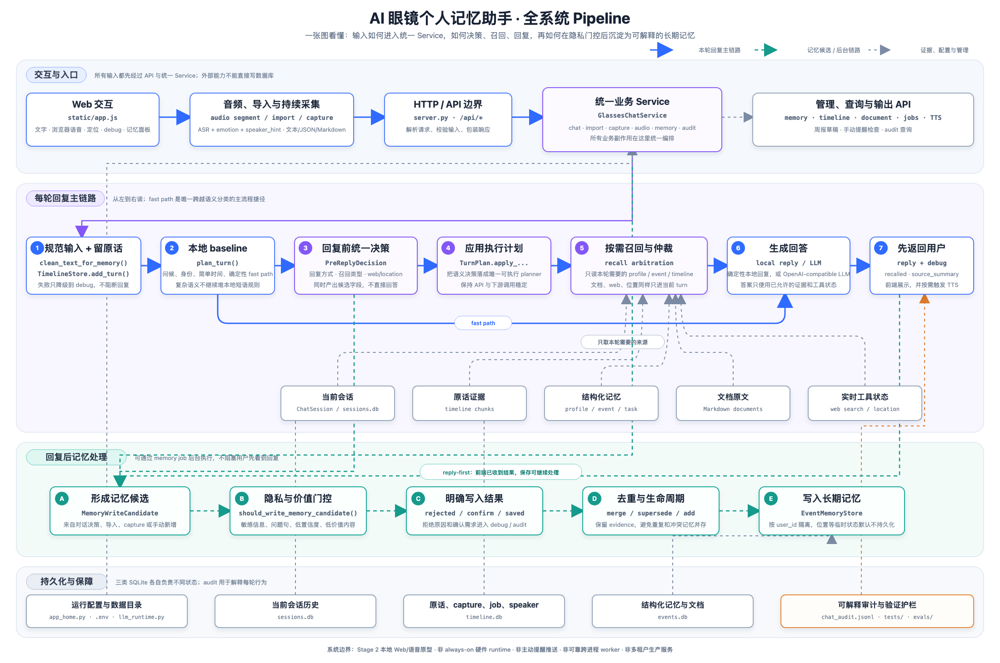

# 开发者上手入口

本目录只保留三份当前态文档，服务对象是第一次接手项目的开发者。文档只说明现在系统怎么启动、怎么改、怎么验证；不记录历史开发过程、迁移流水账、调研过程或复盘材料。

## 先看总览图



阅读顺序固定为：蓝色实线看本轮回复，绿色虚线看回复后的长期记忆处理，灰色虚线看证据、配置与管理入口，橙色虚线看 audit。图中中文是职责，下一行等宽文字是对应的代码入口；不需要先理解所有 helper 文件。

## 先读顺序

1. `README.md`：项目定位、快速运行、主要 API。
2. `AGENTS.md`：Codex/开发协作规则、验证命令、修改边界。
3. `CONTRIBUTING.md`：私人多人协作流程、分支、验证和提交前检查。
4. `PLANS.md`：当前优先级和下一步。
5. `docs/context/README.md`：本文件，开发者上手索引。
6. `docs/context/code-map.md`：按任务找代码入口。
7. `ai_glasses_memory_assistant/README.md`：包内所有 Python 文件职责速查，适合按文件名反查。
8. `docs/context/system-flow-current.md`：在总览图基础上展开当前系统架构、真实调用链和边界。

## 本地启动

下面命令里的 `/path/to/ai_glasses_memory_assistant` 请替换成你本机 clone 的仓库根目录。

推荐先设置本项目自己的 home：

```bash
export AI_GLASSES_HOME="$HOME/.ai-glasses-memory-assistant"
```

默认数据位置：

```text
$AI_GLASSES_HOME/data/events.db
$AI_GLASSES_HOME/data/timeline.db
$AI_GLASSES_HOME/data/sessions.db
$AI_GLASSES_HOME/data/chat_audit.jsonl
```

默认标准库 server：

```bash
cd /path/to/ai_glasses_memory_assistant
conda run -n hermes python -m ai_glasses_memory_assistant.server
```

默认访问：

```text
http://127.0.0.1:8765
```

本机浏览器使用这个 loopback 地址即可在 HTTP 下访问麦克风。若启动提示 `port is already used`，先用 `lsof -nP -iTCP:8765 -sTCP:LISTEN` 停止旧 HTTP/HTTPS server，或显式指定其他 `--port`；同一端口不要同时运行两个协议实例。

局域网设备测试语音或定位时使用 HTTPS：

局域网 IP 的 HTTP 页面不是浏览器安全上下文，只能展示普通页面，不能使用“开启全天待机”、声纹录入或定位。启动 HTTPS 后使用日志输出的 `https://<Mac 局域网 IP>:8765`。

```bash
cd /path/to/ai_glasses_memory_assistant
conda run -n hermes python -m ai_glasses_memory_assistant.server --certfile certs/cert.pem --keyfile certs/key.pem
```

## LLM 配置

推荐把配置写到：

```text
$AI_GLASSES_HOME/.env
```

可以从示例文件开始：

```bash
mkdir -p "$AI_GLASSES_HOME"
cp .env.example "$AI_GLASSES_HOME/.env"
```

默认使用 DeepSeek/OpenAI-compatible API：

```bash
AI_GLASSES_LLM_PROVIDER=deepseek
AI_GLASSES_LLM_MODEL=deepseek-v4-flash
AI_GLASSES_LLM_BASE_URL=https://api.deepseek.com
AI_GLASSES_LLM_API_KEY=<your-api-key>
AI_GLASSES_LLM_API_MODE=chat_completions
AI_GLASSES_LLM_TRANSPORT=openai_sdk
```

桌面默认 transport 是 `openai_sdk`；Android 内嵌 runtime 使用 `stdlib_http`，业务层仍复用同一个 `LLMClient` 接口。

如果 `AI_GLASSES_LLM_PROVIDER=deepseek` 且未设置 `AI_GLASSES_LLM_API_KEY`，运行时会尝试读取 `DEEPSEEK_API_KEY`。缺少 model、base URL 或 API key 时应直接报错。

主 LLM runtime 不再保留本地模型默认值或 legacy fallback。

音频模型变量：

```text
AI_GLASSES_ASR_MODEL_DIR
AI_GLASSES_STREAMING_ASR_MODEL_DIR
AI_GLASSES_SPEAKER_MODEL_DIR
AI_GLASSES_EMOTION_MODEL_DIR
AI_GLASSES_KWS_MODEL_DIR
AI_GLASSES_KWS_KEYWORDS_FILE
AI_GLASSES_WAKE_ACK_TEXT
```

模型目录保持在仓库外。未配置 streaming ASR 或 KWS 时，ambient 逐段转写仍可运行，但 capability 和页面会明确显示“语音唤醒问答不可用”；网页不提供手动唤醒降级入口。

全天讨论归档使用 `AI_GLASSES_DISCUSSION_*` 集中配置。默认以静音 180 秒、连续 900 秒、40 个 final 片段或跨日为切片边界，回顾最多等待后台归档 15 秒；脱敏后的 ambient 原文保留 30 天，话题和每日摘要保留到用户手动删除。最近 6 段仍只用于“刚才”即时上下文，不是全天输入上限。

## 依赖边界

当前 Python 包配置在 `pyproject.toml`。默认依赖只有 `openai`；可选能力按 extra 分组：

| extra | 依赖 | 用途 |
| --- | --- | --- |
| `tts` | `edge-tts` | 可选语音播报 |
| `voice` | `funasr`、`torch`、`numpy`、`soundfile` | 可选本地 ASR、声学情绪、声纹模型 |
| `voice-stream` | `silero-vad`、`sherpa-onnx` | 可选流式 VAD/KWS；缺少 Silero 时只保留收音诊断，不开放持续音频工作流 |
| `dev` | `pytest` | 测试 |

正式发布或部署前必须重新检查依赖 pin、package data 和安装流程。

## 常用验证

文档或小改动：

```bash
cd /path/to/ai_glasses_memory_assistant
git diff --check
```

Python 改动至少跑：

```bash
cd /path/to/ai_glasses_memory_assistant
conda run -n hermes python -m py_compile ai_glasses_memory_assistant/*.py ai_glasses_memory_assistant/evals/*.py server.py
conda run -n hermes python -m pytest tests -q
```

默认单元测试包括 `tests/test_audio_engine.py` 的 fake backend 音频契约，不加载真实模型。

需要 live eval 时：

```bash
cd /path/to/ai_glasses_memory_assistant
conda run -n hermes python -m ai_glasses_memory_assistant.evals.runner --mode live --repeat 3 --strict
```

## 当前边界

当前同时包含局域网 Web/语音原型、`android/` 下的 Android 8+ arm64 本地 demo，以及 `ios/AIGlassesMicProbe/AIGlassesMemoryAssistant` 的 iOS 16+ 开发 Target。iPhone 已复用网页界面和原生桥接，但目前只能完成无签名 arm64 主机构建：匹配 CPython 3.11.9 的 arm64 `numpy 1.26.2`、sherpa 五组件推理和 iPhone 真机安装尚未验证，待机/声纹入口会拒绝启动，不能当作可用的正式聊天或记忆客户端。Android 通过 Chaquopy 复用同一 Python 业务核心，并用前台麦克风服务承接锁屏收音；设置页可在停止收音后导出不含 key、PCM 和声纹向量的密码加密诊断包。当前仍不是完成真人声学、8/24 小时耐久、签名分发和异常矩阵验收的生产级硬件 runtime，也不是主动提醒或生产级多租户服务。

代码是真相。文档冲突时先读代码，再修文档。
