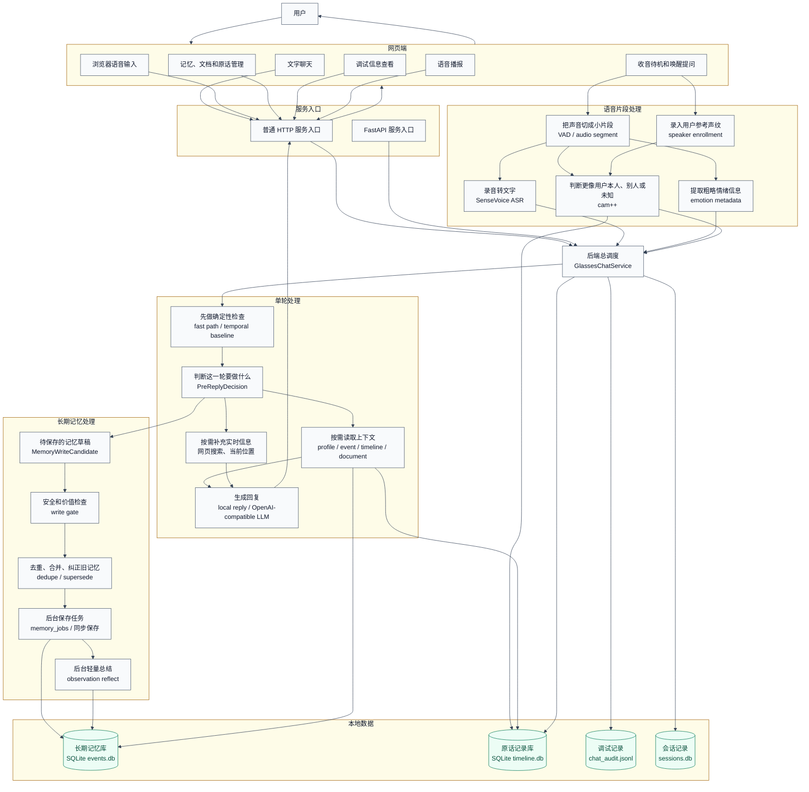
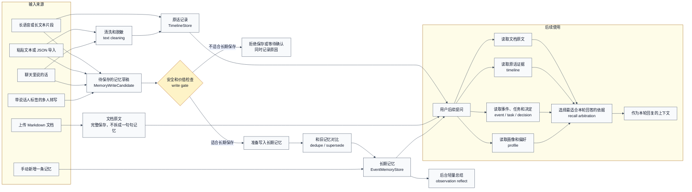
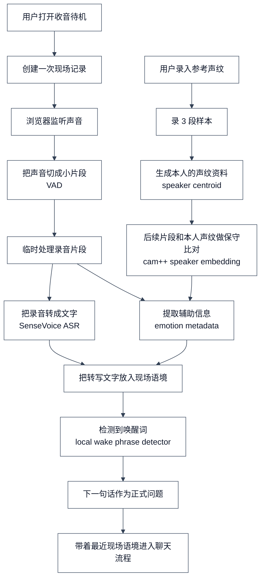
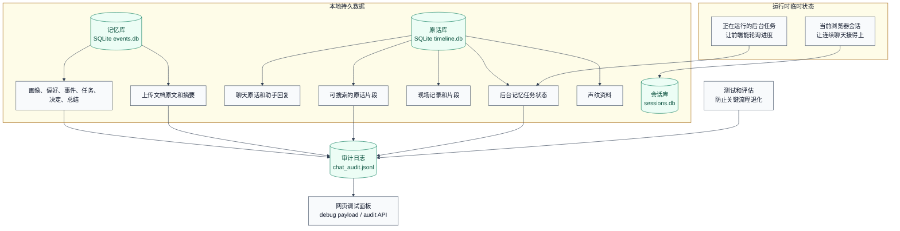

# 当前系统流程现状

更新时间：2026-07-08。本文记录当前系统如何工作、数据如何流转、哪些能力已经落地、哪些仍是边界。代码仍是真相；如果本文和代码冲突，先以代码为准，再更新本文。

## 阅读方式

建议按三层阅读：

1. 先看图，理解系统从输入到回复、保存记忆和排查问题的大方向。
2. 再看“步骤”，确认每一步实际发生什么。
3. 最后看“实现对应”，知道这些步骤在代码和数据文件里对应哪里。

## 一句话总览

当前系统的主流程是：

```text
用户输入 -> 系统判断这一轮要做什么 -> 找资料/查记忆/查实时信息 -> 回复用户 -> 判断是否沉淀长期记忆 -> 留下调试记录
```

系统不会把所有聊天都直接变成长期记忆。每条可能有长期价值的信息，会先变成“待保存的记忆草稿”，再经过安全和价值检查，确认不是敏感信息、不是普通问题、不是低价值临时内容后，才会写入长期记忆库。

## 图 1：系统整体如何协作



### 这张图说明什么

系统由五块组成：网页端、服务入口、后端总调度、长期记忆处理、本地数据。用户看到的是聊天、语音和记忆管理；真正决定“怎么回复、要不要查记忆、要不要保存”的是后端总调度。

### 一步一步发生了什么

1. 用户通过文字、语音、收音待机、手动记忆或文档上传进入系统。
2. 服务入口把请求交给后端总调度。
3. 后端先判断这轮属于哪类情况：能本地快速处理，还是需要大模型和更多上下文。
4. 如果需要，系统读取长期记忆、原话记录、文档内容、当前位置或网页实时信息。
5. 系统回复用户。
6. 如果这一轮包含值得长期保存的内容，系统会先生成记忆草稿，再做安全和价值检查。
7. 通过检查的内容进入长期记忆库；没有通过的内容只记录原因，不会保存为长期记忆。
8. 每轮处理都会留下调试记录，方便之后解释“为什么这么回答、为什么保存或没保存”。

### 实现对应

- 网页端：`static/app.js`、`static/index.html`、`static/styles.css`
- 服务入口：`server.py` 和 `app.py`
- 后端总调度：`agent_bridge.py` 中的 `GlassesChatService`
- 单轮判断：`turn_planner.py` 和 `turn_semantic_classifier.py`
- 长期记忆库：`events.db`，由 `memory_store.py` 管理
- 原话记录库和后台任务状态：`timeline.db`，由 `timeline_store.py` 管理
- 调试记录：`chat_audit.jsonl`

## 图 2：用户发来一句话后发生什么

```mermaid
%%{init: {"theme": "base", "themeVariables": {"background": "#ffffff", "mainBkg": "#ffffff", "primaryColor": "#f8fafc", "primaryTextColor": "#0f172a", "primaryBorderColor": "#475569", "secondaryColor": "#eef2ff", "secondaryTextColor": "#0f172a", "secondaryBorderColor": "#6366f1", "tertiaryColor": "#fefce8", "tertiaryTextColor": "#0f172a", "tertiaryBorderColor": "#a16207", "lineColor": "#334155", "textColor": "#0f172a", "fontFamily": "Arial, sans-serif"}}}%%
flowchart LR
    Input["收到一句话<br/>文字或语音转写"]
    Raw["先留下原话记录<br/>TimelineStore"]
    Context["整理现场上下文<br/>最近对话和收音片段"]
    Why{"是在问为什么吗？"}
    AuditLookup["查上一轮调试记录<br/>chat_audit.jsonl"]
    Explain["解释原因<br/>为什么这样答或没记住"]

    Judge["判断这一轮要做什么<br/>PreReplyDecision"]
    Fast{"能快速处理吗？"}
    FastReply["直接回复或低打扰确认<br/>问候、身份、敏感凭证、超长口述"]

    NeedInfo{"需要更多资料吗？"}
    ReadMemory["查长期记忆<br/>EventMemoryStore"]
    ReadRaw["查历史原话<br/>TimelineStore"]
    ReadDoc["查上传文档"]
    ReadLive["查实时信息<br/>网页搜索、当前位置"]
    Ready{"本地足够回答吗？"}
    LocalReply["本地组织回复"]
    ModelReply["调用大模型生成回复<br/>OpenAI-compatible LLM"]

    SaveQuestion{"有值得保存的内容吗？"}
    NoSave["不保存长期记忆<br/>只记录原因"]
    SaveMode{"需要先回复再保存吗？"}
    SyncSave["同步检查并保存<br/>write gate"]
    AsyncSave["创建后台记忆任务<br/>memory_jobs"]
    FinalLog["补写助手回复和审计记录<br/>TimelineStore / chat_audit.jsonl"]
    Return["返回给前端展示"]

    Input --> Raw --> Context --> Why
    Why -->|是| AuditLookup --> Explain --> FinalLog
    Why -->|不是| Judge --> Fast
    Fast -->|是| FastReply --> SaveQuestion
    Fast -->|不是| NeedInfo

    NeedInfo -->|需要| ReadMemory --> Ready
    NeedInfo -->|需要| ReadRaw --> Ready
    NeedInfo -->|需要| ReadDoc --> Ready
    NeedInfo -->|需要| ReadLive --> Ready
    NeedInfo -->|不需要| Ready

    Ready -->|足够| LocalReply --> SaveQuestion
    Ready -->|不够| ModelReply --> SaveQuestion

    SaveQuestion -->|没有| NoSave --> FinalLog
    SaveQuestion -->|有| SaveMode
    SaveMode -->|可以当场处理| SyncSave --> FinalLog
    SaveMode -->|先回复，后台处理| AsyncSave --> FinalLog
    FinalLog --> Return

    classDef default fill:#f8fafc,stroke:#475569,color:#0f172a,stroke-width:1px;
    classDef decision fill:#fef3c7,stroke:#b45309,color:#111827,stroke-width:1px;
    classDef storage fill:#ecfdf5,stroke:#047857,color:#064e3b,stroke-width:1px;
    class Why,Fast,NeedInfo,Ready,SaveQuestion,SaveMode decision;
    class Raw,ReadMemory,ReadRaw,AuditLookup,FinalLog storage;
```



### 这张图说明什么

一句话进入系统后，不是直接丢给大模型。系统会先留痕，再判断这一轮属于什么情况；需要资料时才查记忆、原话、文档、网页或位置；回复之后，再决定有没有内容值得沉淀为长期记忆。

### 一步一步发生了什么

1. 用户输入进入前端页面。
2. 后端先保存用户原话，保证之后能追溯“当时到底说了什么”。
3. 系统整理最近几轮对话和收音待机里保留的现场语境。
4. 如果用户是在问“为什么这样回答/为什么没记住”，系统直接查审计记录给解释。
5. 普通聊天会先判断这一轮要做什么：是否能快速处理，是否需要查资料，是否可能要写记忆。
6. 如果需要更多资料，系统才读取长期记忆、历史原话、上传文档、网页实时信息或当前位置。
7. 本地信息够用就本地组织回复；不够时才把受控上下文交给大模型生成回复。
8. 回复后，系统判断有没有值得保存的内容：没有就只记录原因，有就同步保存或放到后台任务里处理。
9. 最后补写助手回复和审计记录，再把回复、召回内容、保存结果和调试信息返回前端。

### 实现对应

- 聊天入口：`POST /api/chat`
- 后端总调度：`GlassesChatService.chat()`
- 原话先保存：`TimelineStore.add_turn()`
- 轮次判断：`plan_turn()` 和 `classify_pre_reply_decision()`
- 同步或后台记忆保存：`_save_memory_candidates()`、`_create_memory_job()`
- 调试记录：`_append_audit_record()`

## 图 3：一句话如何变成长期记忆



### 这张图说明什么

系统里有三层不同的数据，不要混在一起看：

| 层级 | 保存什么 | 例子 | 用途 |
| --- | --- | --- | --- |
| 原话记录 | 用户当时说过的原文或转写文本 | “我明天下午 3 点和 Alex 开会” | 追溯证据、原话搜索 |
| 长期记忆 | 系统整理后的稳定事实、偏好、任务和事件 | “用户明天下午 3 点和 Alex 开会” | 后续问答召回 |
| 文档原文 | 用户上传的完整 Markdown 文档 | 项目计划、行程说明、会议材料 | 后续问文档细节 |

### 一步一步发生了什么

1. 输入可以来自聊天、手动新增、文本导入、文档上传、长输入片段或多人转写。
2. 聊天和长输入会先保存一份原话记录。
3. 系统从输入里提取可能有长期价值的“记忆草稿”。
4. 记忆草稿必须经过安全和价值检查：敏感信息、普通问题、低价值临时内容不会直接保存。
5. 合格的草稿会和旧记忆对比：重复的合并证据，用户改口的更新旧记忆状态。
6. 保存后的长期记忆可以在后续问答中被召回。
7. 文档上传走单独的文档层：先完整归档，用户之后问细节时再读文档原文。
8. 如果有多条来源记忆，后台可以形成轻量总结，作为之后回顾的线索。

### 实现对应

- 待保存的记忆草稿：`MemoryWriteCandidate`
- 安全和价值检查：`should_write_memory_candidate()`
- 去重、合并、纠错：`find_similar_memory()`、`merge_memory_evidence()`、`mark_superseded()`
- 长期记忆和文档：`EventMemoryStore`、`events.db`
- 原话记录和后台任务状态：`TimelineStore`、`timeline.db`
- 选择本轮依据：`memory_recall_arbitration.py`

## 图 4：语音待机和唤醒如何进入系统



### 这张图说明什么

语音待机不是把所有声音直接长期保存。当前流程是：先把短录音片段临时处理成文字，把最近几段文字放进“现场语境”；听到唤醒词后，下一句话才作为正式问题进入聊天流程。

### 一步一步发生了什么

1. 用户在网页端开启收音待机。
2. 系统创建一段现场记录，用来保存最近的转写文字。
3. 浏览器录音，并用简单的声音检测把音频切成小片段。
4. 后端临时处理录音片段，处理完删除原始音频。
5. 系统把录音转成文字，并提取少量辅助信息，例如粗略情绪和说话人线索。
6. 转写文字被加入最近现场语境。
7. 如果检测到唤醒词，系统把下一句话当作正式问题。
8. 正式问题进入普通聊天流程，并可以引用最近现场语境。
9. 声纹录入是可选增强：用户录 3 段样本后，后续片段可以更保守地判断更像本人、别人或未知。

### 实现对应

- 开始、追加、停止现场记录：`/api/capture/start`、`/api/capture/append`、`/api/capture/stop`
- 录音片段处理：`/api/audio/segment/process`
- 声纹录入：`/api/speaker/enroll`
- 语音片段处理入口：`AudioSegmentProcessor`
- 声纹资料保存位置：`timeline.db` 的 `speaker_profiles`
- 当前边界：这仍是网页端演示链路，不是后台常驻硬件收音系统。

## 图 5：系统把数据放在哪里、如何排查问题



### 这张图说明什么

系统既有临时状态，也有本地持久数据。临时状态负责当前页面里的连续聊天和正在跑的后台任务；本地持久数据负责长期记忆、原话、文档、声纹资料和调试记录。

### 一步一步发生了什么

1. 当前浏览器会话保存临时聊天历史，所以连续对话能接上。
2. 后台记忆任务有运行中状态，前端可以查询它是否保存完成。
3. 长期记忆和文档存在记忆库里。
4. 原话、现场片段、后台任务状态和声纹资料存在原话库里。
5. 每轮处理结果会写入审计日志，记录本轮用了哪些来源、为什么保存或拒绝保存。
6. 网页调试面板读取这些调试信息，帮助定位问题。
7. 测试和评估用来防止聊天、记忆、召回和边界行为退化。

### 实现对应

- 记忆库：`events.db`，包括 `memories` 和 `documents`
- 原话库：`timeline.db`，包括 `raw_turns`、`chunks`、`captures`、`memory_jobs`、`speaker_profiles`
- 会话库：`sessions.db`
- 审计日志：`chat_audit.jsonl`
- 调试面板：`static/app.js` 读取 `/api/chat` 返回的 `debug` 和 `/api/debug/audit`
- 测试和评估：`tests/`、`evals/`

## 当前已实现能力

- Web 文字聊天和浏览器语音输入。
- 收音待机、录音片段转文字、唤醒词检测、唤醒后引用最近现场原话。
- 3 段声纹校准，以及片段级“更像本人、别人或未知”的保守判断。
- 用户画像、偏好、事件、任务、决策、项目状态和轻量总结的结构化保存与召回。
- 原话保存、原话搜索、证据追溯和删除联动。
- Markdown 文档归档和文档细节召回。
- 回复优先的后台记忆任务、任务查询和重启后的公开状态恢复。
- 周报草稿和手动提醒候选检查。
- 调试记录、审计日志、单元测试和评估场景支撑排障。

## 当前边界

- 这是本地 Web/语音 demo，不是生产级硬件眼镜运行时。
- 当前没有原生手机 App，只是用 Web UI 和 API 模拟未来 App/眼镜入口。
- 收音待机是前端演示链路，不是后台常驻收音服务。
- 唤醒词检测是本地短语检测，不是完整硬件级唤醒词方案。
- 手动提醒检查不是主动推送提醒。
- 后台记忆任务是 demo 级状态记录，不是生产级可靠任务队列。
- SQLite 本地存储适合单机 demo 和验证，不是生产级多租户权限系统。
- 长期记忆必须经过草稿、检查和保存流程；不要把“听到/看到”直接等同于“已经长期保存”。
