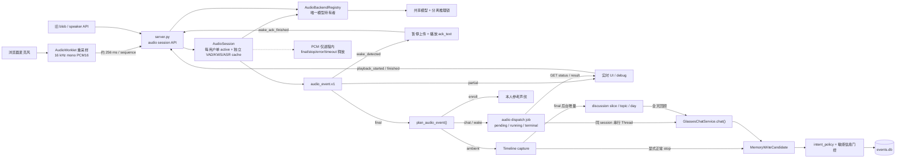
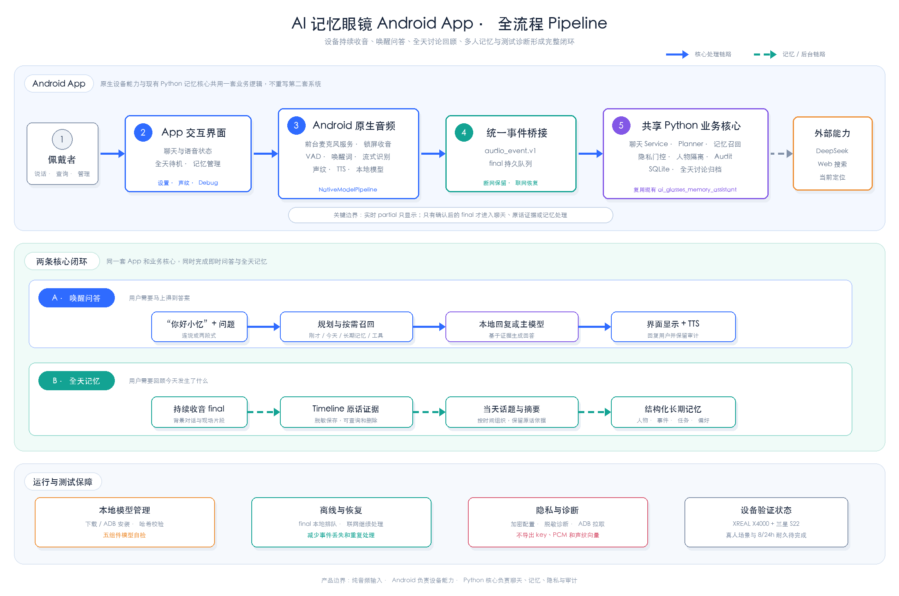

# 当前系统架构

本文只记录当前系统怎么工作、数据怎么流转、边界在哪里。代码是真相；如果本文和代码冲突，先读代码，再修文档。

## 一句话

这是 AI 眼镜个人记忆助手的本地 Web/语音原型：用户输入先被回复，再按需沉淀为长期记忆；后续问题可以按需召回画像、事件、任务、文档和原话证据，并通过 debug/audit 解释为什么读、写或拒绝保存。

## 系统总览图


总图只保留新人必须先理解的职责边界：`server.py` 是薄 HTTP 层，`GlassesChatService` 是统一编排层，`PreReplyDecision` 决定非 fast path 的回复与召回方向，长期记忆候选必须经过 `should_write_memory_candidate()`，而 `sessions.db`、`timeline.db`、`events.db` 和 `chat_audit.jsonl` 分别承担不同状态。音频录制、唤醒和兼容入口的细节由 `assets/frontend-audio-data-flow.mmd/.svg` 展开。

## 系统边界

当前已经具备：

- Web 文字聊天、按体验者 ID 隔离的浏览器流式语音、TTS、定位、debug 面板。
- `/api/chat` 主链路。
- SQLite 结构化记忆和原话 timeline。
- reply-first 后台 memory job。
- 文本/JSON 导入、Markdown 文档归档、continuous capture。
- 启发式周报草稿和手动提醒候选检查。
- 统一音频 session、VAD、KWS-only 两段式唤醒、partial/final ASR、ambient capture、声纹参考和匿名 voice group。
- final ambient transcript 的增量讨论归档、按日/话题回顾和 30 天内原文核对。

当前不是：

- 生产级硬件眼镜 runtime。
- 已完成签名分发和耐久验收的生产级原生手机 App。
- 已完成 8/24 小时验收的 always-on audio runtime。
- 生产级 diarization 或联系人归因系统。
- 主动提醒推送系统。
- 可靠跨进程 worker 队列。
- 多租户生产服务。

## 主流程

```text
前端或 API 请求
-> server.py
-> GlassesChatService
-> 本地 baseline 和 fast path
-> PreReplyDecision
-> TurnPlan.apply_pre_reply_decision()
-> 按需读取记忆、原话、文档、位置或 web
-> 本地回复或 OpenAI-compatible LLM
-> 生成记忆候选
-> 写入门控
-> 去重、合并或 supersede
-> SQLite / audit / response
```

`PreReplyDecision` 同时决定回复模式、召回类型、web/location 需求、记忆候选字段和 correction/explanation flags。旧 router 和旧 `intent_classifier.py` 不再是当前架构的一部分。

`GlassesChatService.chat(skip_reply_synthesis=False)` 只提供评测提速开关：开启时跳过 correction 检测、answer directive 合成和主模型回复生成（`reply` 置空），但保留 `PreReplyDecision`、召回、时间解析、web/location 和 Timeline 写入；生产入口（server.py 等）永不传此参数，实测链路默认完全不变。

## Service 和 Helper 分工

`agent_bridge.py` 是业务 service 调度层：负责把聊天、导入、capture、文档、后台 job、audit、timeline 和 memory gate 串起来。纯 helper 叶子逻辑按主题放在独立 helper 模块。

当前 helper 边界：

- `response_timing.py`：只负责 assistant response timing 和 debug trace payload。
- `llm_runtime.py`：只负责 demo LLM 环境变量解析、DeepSeek fallback 和 OpenAI-compatible client 创建。
- `document_helpers.py`：负责文档标题/摘要、文档查询识别、标题匹配评分和文档上下文拼装。
- `import_helpers.py`：负责文本/JSON 导入条目拆分、分类和候选包装。
- `memory_job_helpers.py`：负责后台 memory job 公开 payload、processing payload 和阶段说明。
- `timeline_management_helpers.py`：负责 timeline 管理接口的 chunk payload、删除结果说明和 redaction debug。
- `source_summary_helpers.py`：负责 source summary 和 audit summary 的来源计数、主来源说明和删除来源 debug payload。
- `explanation_helpers.py`：负责解释类问题识别、解释回复展示文案、局部不保存范围说明和 evidence trace 格式化；上一轮 audit/job/timeline evidence 读取仍在 service。
- `report_helpers.py`：负责周报草稿、attention items 展示文案、项目归类和背景 observation 判断；查询、时间窗口和 audit 仍在 service。
- `capture_helpers.py`：负责 continuous capture 摘要和确认回复文案。
- `conversation_helpers.py`：负责 speaker-labeled transcript 结构解析。
- `conversation_candidate_helpers.py`：生成多人 transcript 的结构化隐私 extraction plan，处理 user/known/unknown、alias 和敏感 fragment；不使用本地业务词表生成语义候选。fragment 按句末标点切分（逗号/分号不再切，避免一条事实碎成多块）。

大多数 helper 只拆分实现归属；多人 transcript 的结构化隐私 plan 是例外，它会在普通 `PreReplyDecision` 前把输入切换到 reply-first 安全路径。该路径不改变 HTTP API 字段、数据库 schema 或最终 memory gate。

## 记忆写入

长期记忆不是自动保存所有聊天。写入流程是：

```text
MemoryWriteCandidate
-> should_write_memory_candidate()
-> rejected / requires_confirmation / saved
-> find similar memory
-> merge / supersede / add
-> EventMemoryStore
```

必须保留的边界：

- 敏感信息不能静默保存，包括密码、验证码、银行卡、API key、token、证件号等。
- 普通问题、临时上下文、低价值闲聊不应写长期记忆。
- 位置是当前 turn 临时状态，除非用户明确要求保存，否则不写长期记忆。
- 结构化记忆应尽量关联本轮 timeline evidence，方便后续解释来源。

会话导入（`import_conversation_events`）默认对同一 session 的全部 user fragment 做一次批量分类（`classify_import_items_batch`，`AI_GLASSES_IMPORT_BATCH_CLASSIFY=0` 关闭），逐 fragment 分类仅作为批量失败时的回退；门控、敏感过滤和 timeline 证据链不变。

## 召回与证据

系统按当前 turn 需要召回，不是每轮默认读全部历史：

- profile / preference：用户画像、长期偏好。
- event / task / decision / risk：事件、任务、决定、风险。
- timeline：原话证据和全文回忆。
- document：上传文档原文和片段。
- observation：后台轻量归纳。
- discussion archive：处理切片、当天话题和每日概览；全天问题优先使用它，原话追问再读取 evidence chunk。

召回结果只注入当前 turn，不改 system prompt。多来源同时出现时，由 recall arbitration 决定本轮主证据。

对 `PreReplyDecision` 已固定为 `complete_set` 的数量/总数问题，召回范围仍由该决策唯一决定；后续 Reader 只是确定性执行：逐来源分类、提取有来源绑定的事实项，由共享账本用 `Decimal` 重算总值，再让模型按核算值组织最终措辞。最终措辞同时接收固定的 intent、focus、obligations、uncertainty 和 coverage 合同；只有合同包含 `entities`、`qualifiers` 或 `temporal_relation` 时，才保留并输出证据支持的对象、属性或时间关系，纯 `count_scope` 不自动扩成清单。一个来源可明确支持多个不同事实，但只能在 `source_decisions` 中分类一次。证据覆盖不完整返回 `insufficient_evidence`；provider、JSON、账本或最终输出失败会保留已定位的候选证据数量与授权范围，而不能伪装成没有记忆。环境讨论的 complete-set 则直接按 PPD 的 `personal|environment|mixed`、话题闭包和 speaker provenance 渲染：环境片段数、姓名提及或团队名均不能推断人数、逐人发言或用户经历。产品和 LongMemEval Reader 使用同一套账本校验规则。

## 全天讨论归档

`ambient_audio_text` 的 final 转写先脱敏写入 Timeline，再由后台归档形成三级派生数据：

```text
final transcript chunk
-> discussion_slices（有界、幂等处理）
-> discussion_topics（同一天可跨多个 time_spans 合并）
-> discussion_days（按首次出现时间生成每日概览）
```

- 静音 3 分钟、连续 15 分钟、40 段、跨本地自然日、正常停止或回顾请求都会封存当前切片。
- PCM 上传不等待摘要。回顾请求会封存未处理片段并最多等待 15 秒；超时返回已完成摘要和可用原文，同时在 debug 标记未完成切片。
- 服务启动会有界恢复 `pending/running/failed` 切片和异常退出留下的未覆盖 final，但不会触发只有正常 stop 才允许的长期记忆抽取。
- 最近 6 段只负责“刚才/刚刚”；当天或多日回顾以 discussion archive 为主，结构化长期记忆为补充。
- ambient 原文默认 30 天后物理删除；每日摘要继续保留，evidence 状态改为原文已过期。用户可按天单独删除 raw、summary 或 all，结构化长期记忆仍需在原记忆管理入口单独删除。

## Import、Capture 和文档

- `POST /api/memory/import` 支持文本和 JSON items，最终进入同一套候选、门控、去重和写库流程。
- Markdown 上传保存完整文档原文，不按每行拆成长期记忆。
- `/api/capture/start|append|stop` 用于连续文本或转写片段汇总；stop 后复用 import 管道。
- speaker-labeled transcript 在普通 `PreReplyDecision` 之前进入 reply-first 结构化隐私路径；安全片段逐说话人进入统一语义分类，候选携带 speaker 来源后再经过最终 memory gate。
- 新输入来源不要绕过写入门控，也不要绕过 `user_id` 隔离。

## Job、周报和提醒

- memory job 用于 reply-first 后台保存，生命周期仍由 `agent_bridge.py` 管；公开 payload 和阶段说明在 `memory_job_helpers.py` 里生成。
- `read_memory_job()` 可在服务重启后读取公开状态，但这不是可靠 worker 队列。
- `weekly_report()` 是启发式周报草稿，不是完整项目管理系统。
- `check_reminders()` 是手动检查未来 task 候选，不是主动推送 runtime。

## Web、位置和工具状态

实时问题应通过工具状态约束回答：

- 未触发 web search 时，不能声称“正在搜索”或编造实时结果。
- 搜索完成但无结果时，应明确没有可用结果。
- 有搜索结果时，应基于工具上下文回答。
- 定位缺失时不能猜城市或当前位置。

## 音频边界




- `server.py` 仍是唯一 HTTP 入口；外部 `main.py`、`memory_runtime.py` 和外部数据库不进入运行时。
- 网页只有“开启/停止全天待机”一个日常音频控制。浏览器按约 256 ms POST PCM；引擎内部按 16 kHz、512 samples/32 ms 运行 VAD，流式模型可用时约每 0.512 秒产生 partial。
- service 层对同一 `user_id` 只保留一个 active 音频 session；新 ambient 或 speaker enrollment 原子接管旧 session，旧 token 立即失效，旧 ambient capture 只标记 interrupted，不调用 `stop_capture()` 或创建长期记忆 job。不同用户互不影响。
- 网页从 ambient 切换到声纹录入时先 flush Worklet 尾包，再用 `stop_reason=pause_for_enrollment` 停止旧 session；已完成和刚 final 的文本保留在 paused capture，但不调用 `stop_capture()` 或创建记忆 job。录入完成、取消或失败后，只为原 `user_id` 恢复全天待机。
- server 在读取音频 JSON body 前校验唯一、非负且合法的 `Content-Length`。流式 PCM、旧 blob、声纹录入分别使用 `AudioEngineSettings` 的集中上限；超限返回 `413`，缺失/非法/Transfer-Encoding/短读/超时均关闭连接，不会按声明长度无限阻塞或分配内存。
- `GET /api/audio/capabilities` 分别公开 `audio_input_ready`、`ambient_transcription_ready`、`assistant_query_ready` 和 `speaker_enrollment_ready`。页面按浏览器收音能力与真实后端组合显示四项状态；持续转写、唤醒问答和声纹录入都要求 Silero VAD 为 `ready`，energy fallback 只保留收音诊断，不得开放长时间待机。缺少 SenseVoice、KWS/Paraformer 或 Cam++ 时对应入口同样明确不可用；service 会在 takeover/capture 创建前拒绝不可用模式。响应只含 backend/status/reason，不返回模型绝对路径。
- KWS 命中后丢弃唤醒词片段，前端暂停麦克风上传并播放配置的回应；唤醒回应和正式回答都会用唯一 `playback_id` 发送 `playback_started/finished`，服务端在配置的最大播放窗口内不按普通 idle 误回收，迟到 finished 不能结束新播放。
- `wake_ack_finished` 只在唤醒回应播放结束后发送并恢复同一 session，10 秒内等待用户开始提问，开口后不设固定时长，直到 VAD 静音 final。页面关闭仍发送 interrupted stop；finished 因断网丢失时，默认 300 秒播放窗口结束后恢复 idle 回收。
- `transcript_partial` 只更新 UI/debug，不调用聊天、不追加 capture、不写 audit final、不创建 `MemoryWriteCandidate` 或 memory job。
- final 由 `plan_audio_event()` 分为 chat、capture、enroll 或 drop。chat final 只创建一次进程内 dispatch job，PCM push 不等待模型回答；前端通过 `GET /api/audio/dispatch/jobs` 轮询 `pending/running/completed/failed/cancelled/interrupted` 并展示最终回答。
- 同一音频 session 的 chat job 串行执行，避免并发修改同一对话；正常 stop 允许已接收 job 完成，interrupted stop 取消尚未开始的 job，service close 等待运行中 job 并在超时后标记 interrupted。
- ambient 逐个 `speech_end` 处理并将脱敏 final 作为独立 Timeline chunk；正常 stop 才逐片段进入长期记忆候选，异常/超时标记 `interrupted`。Android `ambient_audio_text` 即使缺少 `speaker_label` 也必须保留 `audio_event_id`、chunk evidence、speaker、overlap 和 `memory_eligible`，禁止退回丢失元数据的纯文本导入。
- 声纹只提供 `user/other/unknown` 和匿名 voice group 证据。`PRED_SPKxxxx` 是 session/capture 内临时标签，不是实名身份；API 不返回 embedding。
- `overlap=suspected/unknown`、他人、未知说话人、环境声和低置信 final 默认不能自动归人或写长期记忆。可信本人片段还必须由语义清洗明确判定为可提取事实且达到记忆置信度；noise/chitchat、低置信或语义 backend fallback 均 fail closed，只保留 Timeline。
- `/api/audio/segment/process`、`/api/speaker/enroll` 和 `/api/capture/*` 保持外部调用兼容，并与实时 session 共享同一 `AudioBackendRegistry`。网页不再运行旧 blob fallback；不支持 AudioWorklet 时明确提示浏览器不支持连续音频。



Android WebView 不使用浏览器麦克风。用户从可见页面启动 microphone Foreground Service 后，`AudioRecord` 和 sherpa-onnx 1.13.4 在原生层生成相同的 `audio_event.v1`；partial 只回显，final 先进入共享 Python 的 `device_audio_events` 持久队列，再复用同一 planner、capture、chat、memory gate 和 audit。原生层负责锁屏生命周期、模型、TTS、声纹 embedding 私有传递和保守 overlap 证据，但不直接写记忆表。

iPhone `AIGlassesMemoryAssistant` 复用相同的 `static/` 页面，并用 WebKit 异步桥接提供独立 Keychain owner ID、原生定位、TTS、状态和高级设置。App 启动或用户保存有效配置后，后台启动 `mobile_runtime.start()`，设置 `WKHTTPCookieStore` 的 `ai_glasses_local_token`，并让 WKWebView 加载 Python 本地 HTTP 地址。输入策略：存在唯一 `bluetoothHFP` 时优先使用；无 HFP 时必须用户在设置中显式打开 `allowPhoneMicFallback` 开关才能使用 iPhone 内置麦克风。状态返回 `input_device_type`、`input_device_source`、`input_device_name`，并通过统一 `set_device_state` 同步到 Python。5 个 sherpa-onnx 模型（~290 MB）在非主线程加载，增加 `idle/loading/ready/failed` 状态机防止重复启动；模型创建失败时返回可见错误而非崩溃。模型包校验结果已缓存。暂停、路由变化、中断、媒体服务重置和离开前台时统一停止 pipeline、AudioEngine 和 Python capture；配置重载按 generation 串行停止旧 capture/runtime 后再发布新 endpoint。`final` 才进入 Timeline/记忆的现有门控保持不变。sherpa-onnx v1.13.4 锁定 ONNX Runtime API 27（onnxruntime 1.27.1），新增 `ios/tools/verify_ios_dependencies.py` 校验依赖、NumPy 1.26.2 arm64 和最终 App 链接布局。numpy 已实际构建并打包到主机 App，但 iOS Python import smoke、真机安装、真实 HFP 路由、文字聊天和记忆/audit 闭环仍未完成；首版只允许前台运行，设备枚举仍受 `CoreDeviceService` 故障阻塞。

非时间型个人 `specific_fact` 查询在同一 turn 搜索相关 profile 和 event，再由统一仲裁和回复链消费两类证据；不能因为 profile 非空而跳过 event，也不能把无关画像送入回答。两类均无直接证据时由 empty-evidence guard 明确回答未找到，直接证据冲突时回复必须指出冲突而不能静默猜测。debug 的 `cross_kind_recall` 记录双来源检索、仲裁采用的记忆 ID 和最终回复路径，音频 memory job 的 `unit_gate_results` 以 `audio_event_id/chunk_id` 记录每个 final 的 saved/rejected 状态和原因。

Android 设置页可在停止收音时创建手动诊断包：Python 用 SQLite backup 生成一致性副本，并移除声纹 profile、录入样本和私有 embedding payload；Kotlin 再用当次密码派生的 AES-256-GCM 密钥加密后交给系统文件选择器。导出包含脱敏 audit、队列/模型状态、设备、电池、内存和版本，不包含 API key、原始 PCM 或声纹向量。

浏览器路径仍不能在页面关闭后作为操作系统后台服务运行；Android 前台服务已经通过一次短时锁屏烟测，但尚未完成真人声学、完整异常矩阵、8/24 小时耐久、完整 diarization、重叠语音模型或联系人实名归因验收。

## API 入口

主要 API：

- `POST /api/chat`
- `GET /api/runtime`
- `GET /api/memories`
- `POST /api/memories`
- `DELETE /api/memories/{memory_id}`
- `GET /api/documents/{document_id}`
- `PATCH /api/documents/{document_id}`
- `DELETE /api/documents/{document_id}`
- `GET /api/memory/search`
- `GET /api/timeline/search`
- `GET /api/timeline/chunks`
- `DELETE /api/timeline/chunks`
- `GET /api/memory/jobs`
- `GET /api/discussions/days`
- `GET /api/discussions/day`
- `DELETE /api/discussions/day?scope=raw|summary|all`
- `POST /api/memory/import`
- `POST /api/capture/start|append|stop`
- `GET /api/audio/capabilities`
- `POST /api/audio/session/start|push|control|stop`
- `GET /api/audio/dispatch/jobs`
- `POST /api/audio/segment/process`
- `POST /api/speaker/enroll`
- `GET /api/speaker/groups`
- `DELETE /api/speaker/groups/{group_id}`
- `GET /api/weekly-report`
- `GET /api/reminders/check`
- `GET /api/debug/audit`
- `POST /api/tts`

标准库 server 是唯一 HTTP 入口；业务行为应保持在 `GlassesChatService` 等 service 层。
